Chapter 1. An Abridged Introduction to Finance
========================================================
* 발표자 : 김무성
* 교재 : 
* 참고자료 - http://www.nomurawarrants.com/glossary.html

# Content

* 1.1 Financial Securities
 -  1.1.1 Bonds and the Continuous Compounding of Interest Rates
 - 1.1.2 Stocks: Trade, Price and Indices
 - 1.1.3 Options and Other Derivatives
 - 1.1.4 Portfolios and Collective Investment
* 1.2 Financial Engineering
 - 1.2.1 Trading Positions and Attitudes
 - 1.2.2 On Price and Value of Stocks. The Discounted 
 - 1.2.3 Arbitrage and Risk-Neutral Valuation Principle
 - 1.2.4 The Efficient Market Hypothesis and Computational Complexity
* 1.3 Notes, Computer Lab and Problems
 - 1.3.1 Bibliographic remarks
 - 1.3.2 Possibly the First Option Contract in Histo1.3.3 On Short Selling
 - 1.3.4 R Lab
 - 1.3.5 Research Problem
 - 1.3.6 Problem (Simple Bounds on Calls and Puts)
 - 1.3.7 Problem (More Strategies with Options)
 - 1.3.8 Problem
 - 1.3.9 Problem

---------------

# 1.1 Financial Securities

 * Financial instruments (금융상품)
 * Securies (유가증권) 
   - http://www.emh.co.kr/content.pl?marketable_securities
   - http://100.daum.net/encyclopedia/view.do?docid=b17a1114a   
 * Debt (채권)
   - bond (채권)
   - commercial note (어음)
   - bank deposit (은행계좌)
 * Equity (지분)
 * Derivative (파생상품)
   - futures Contract (선도) - https://sites.google.com/site/wankyuchoi/home/curriculum/derivatives/4
   - forward Contract (선물) - http://www.valuestar.co.kr/pages/board/plainBody.jsp?id=4506&board=d646580f0b93df2baf15b38477268a61
   - option (옵션) - http://ifins.com.ne.kr/3future/a321.htm
   - swap (스왑) - http://www.bupdori.com/08-000-03-04.htm
   - stock option (스톡옵션)
 * exchange markets (장내 시장)
   - United States are the New York Stock Exchange (NYSE)
   - Chicago Board Options Exchange (CBOE)
   - Nasdaq
   - Europe the London Stock Exchange (LSE)
   - Deutsche Börse, and Spanish Exchange Markets (BME)
   - Tokyo Stock Exchange
   - Shanghai Stock Exchange   

## 1.1.1 Bonds and the Continuous Compounding of Interest Rates

 * A bond is a long-term loan contract between two parties,
 * issuer(발행사) and the holder(보유자)
 * borrower or debtor, lender
 * principal(원금)
 * coupon (이자표) : the successive interest payments
 * maturity date (만기일)
 
 
### Compounding the interest

* Compouding the interest (복리)
 -  We should all be aware that most of all risk–free securities that earn interest at a certain fixed rate have their value computed through time by compounding the interest.
 - This means that the interest earned at a certain moment is added to the current value of the investment and the next interest is computed over the resulting sum.
 - Therefore the value of the security with interest depends not only on the interest rate, but also on the frequency in which the interest is compounded.
 
 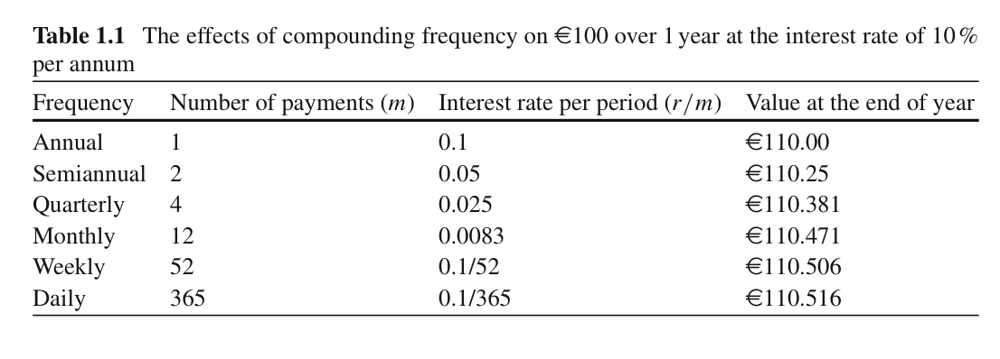
 
 
 
 
 
 

 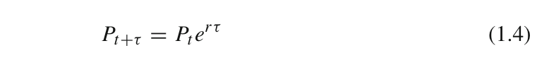

 
 
 


### Payoff and profit of bonds
 
  * payoff
   - The payoff of any security is its value at maturity. For a bond, its payoff is the principal plus all interests paid on the principal, and given by Eq.(1.2), or if continuously compounding of interest is assumed it is given by Eq.(1.3).
  * profit 
   - The profit of a security is its risk-adjusted payoff discounting the initial investment, which includes contract fees or any other transaction costs.
   - For bonds there are usually no transactions costs or fees (or if there were, we can assume them to be included in the principal), and the risk is null.
   - hence, the profit given by a bond is obtained by discounting the principal to the payoff  
   

 
 
----------------------

## 1.1.2 Stocks: Trade, Price and Indices

 * Stock (주식) : A share of a company’s stock is a claim on part of the company’s assets and earnings.
  - common (보통주)
  - preferred (우선주)
  - http://blog.daum.net/daumfinance/5409387 
 * shares outstanding (주식발행)
 * market value or market capitalization (시가총액)
 * shareholder (주주)
 
 

 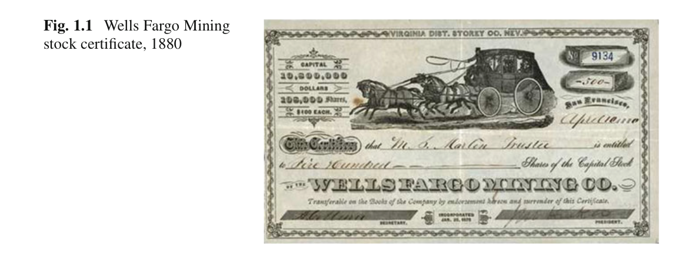
 
 
 * order type - http://www.goodi.com/cst/gchannel/home/gchannel_home_522.htm
  - Market order
  - Limit order
  - Stop orders
 

### Reading a stock quotes table

 
 
 * Ticker : the company’s id for the market (e.g. for General Electric Co. is GE).
 * Open : the price of the stock at the opening time of the market session
 * Close : the price of the stock at the current time, if the market is in session, or the
 * High : (or Max) is the maximum price reached by the stock between the Open and the Close price.
 * Low : (or Min) is the minimum price reached by the stock between the Open and the Close price.
 * Volume : is the number of shares traded between the times of Open and Close.
 * Adjusted Close : is the closing price adjusted to include any dividend payments plus any other corporate actions that affect the stock price (e.g. splits and rights
offerings).

### R Example 1.1


```r
#install.packages("quantmod")
library(quantmod)
```

```
## Loading required package: xts
## Loading required package: zoo
## 
## Attaching package: 'zoo'
## 
## The following objects are masked from 'package:base':
## 
##     as.Date, as.Date.numeric
## 
## Loading required package: TTR
## Version 0.4-0 included new data defaults. See ?getSymbols.
```

```r
# retrieve historical price data for General Electric Co. from Yahoo Finance
getSymbols('GE',src='yahoo', from="2000-01-01", to="2009-12-30")
```

```
##     As of 0.4-0, 'getSymbols' uses env=parent.frame() and
##  auto.assign=TRUE by default.
## 
##  This  behavior  will be  phased out in 0.5-0  when the call  will
##  default to use auto.assign=FALSE. getOption("getSymbols.env") and 
##  getOptions("getSymbols.auto.assign") are now checked for alternate defaults
## 
##  This message is shown once per session and may be disabled by setting 
##  options("getSymbols.warning4.0"=FALSE). See ?getSymbol for more details
```

```
## [1] "GE"
```

```r
# to see headers of file (OHLCV type)
names(GE)
```

```
## [1] "GE.Open"     "GE.High"     "GE.Low"      "GE.Close"    "GE.Volume"  
## [6] "GE.Adjusted"
```

```r
head(GE)
```

```
##            GE.Open GE.High GE.Low GE.Close GE.Volume GE.Adjusted
## 2000-01-03   153.0   153.7  149.2    150.0  22069800       31.67
## 2000-01-04   147.2   148.0  144.0    144.0  22121400       30.40
## 2000-01-05   143.8   147.0  142.6    143.8  27292800       30.35
## 2000-01-06   143.1   146.9  142.6    145.7  19873200       30.75
## 2000-01-07   148.0   151.9  147.0    151.3  20141400       31.94
## 2000-01-10   152.7   154.1  151.1    151.2  15226500       31.93
```

```r
# extract Adjusted Close
geAdj = GE$GE.Adjusted["2000-01-01/2000-01-20"]
head(geAdj)
```

```
##            GE.Adjusted
## 2000-01-03       31.67
## 2000-01-04       30.40
## 2000-01-05       30.35
## 2000-01-06       30.75
## 2000-01-07       31.94
## 2000-01-10       31.93
```

```r
# compute max, min and mean
max(geAdj); min(geAdj); mean(geAdj)
```

```
## [1] 32.46
```

```
## [1] 30.35
```

```
## [1] 31.45
```

```r
# draw a chart
chartSeries(GE)
```

 

### Payoff and profit of stocks

 
 
 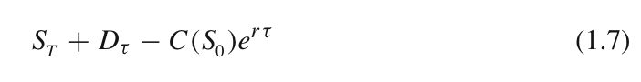
 
### Stock indices

 * Price weighted
  - Dow Jones Industrial Average (DJIA)
  - NYSE ARCA Tech 100
  - Amex Major Market
 * Capitalization-weighted
  - NASDAQ Composite
  - FTSE 100
  - Russell 2000
  - CAC 40
  - IBEX 35

### Example 1.2 (A price weighted index)

The Dow Jones Industrial Average, conceived by Charles Dow and Edward Jones (1896), is computed by the following formula

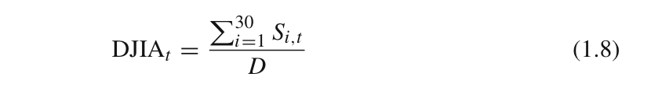


### Example 1.3 (A capitalization weighted index)

The Madrid Stock Exchange principal index, IBEX35, is computed by the following formula

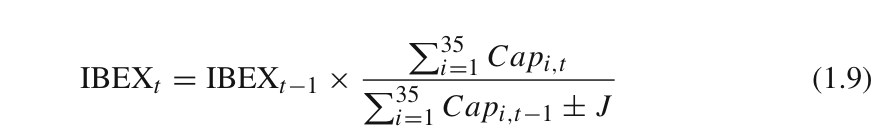


### Example 1.4 (Value Line Stock Index)

One of the most reputed market index, used as benchmark for American and Canadian stock markets, is the Value Line Index. This is a composite index of about 1,700 companies from the New York Stock Exchange, NASDAQ, AMEX, and the Toronto Stock Exchange. Originally launched in 1961, it is calculated as an equally weighted geometric average, the index VLIC. Then in 1988, an arithmetic average version for the same composition of stocks, the VLIA, was released. The formula for calculating the Value Line Geometric Index (VLIC) is


where VLIC_t stands for the value of the index at time t, C_i,_t is the current (or Close) price of stock i at time t , and n is the number of stocks. For the Value Line Arithmetic Index (VLIA), the formula with similar nomenclature is given by


### Comparing the performance of two or more stocks

* As mentioned before, a way that investors have to gauge the performance of their stock investments is to compare their price behavior with another reference stock’s price history, or usually with the history of the market index.
 - cumulative rate of benefits(=return)
 - reference stock or (hypothetically) market index
 - price series


### Example 1.5 As an example of using an index as benchmark for our investments


------------------

## 1.1.3 Options and Other Derivatives

### Options
 * http://ko.wikipedia.org/wiki/%EC%98%B5%EC%85%98_(%EA%B8%88%EC%9C%B5)
 * An option is a contract that investors can buy for a fee in order to have
the opportunity, but not the obligation, to trade an asset in an exchange market at
a future date, and at a given price.
 * exercise date, expiration date or maturity
 * exercise price or strike price
 * call (= buy)
 * put (=sell)
 * excercising the option
 * styles of options
  - European
  - American 
  - Bermudan
  - Asian
  - Barrier
 * vanilla (=European, American)
 * exotic (=other options)
 * path dependent (= Asian, Barrier) -> Monte Carlo methods

### Reading an option quotes

 * preminum : The price of an option, also known as the premium, is given on a per share basis.
 * The writer of an option on a stock presents for negotiation different possibilities of premiums which depends on the stock’s current price, the time to maturity and the type.
 * The options are then organized in series of different premiums, for a fixed maturity date, and quoted at the exchange market using the following standard nomenclature
 
 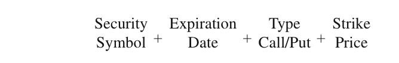

 * http://finance.yahoo.com/q/op;_ylt=AwrSyCTdF61UQnwA7FiTmYlQ?s=GE+Options
 
 
 

### Payoff and profit of options

 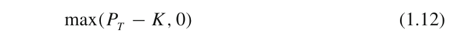

 

 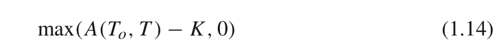
 
 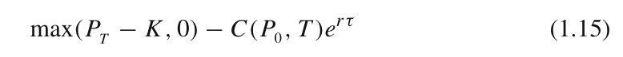
 

#### Example 1.6

 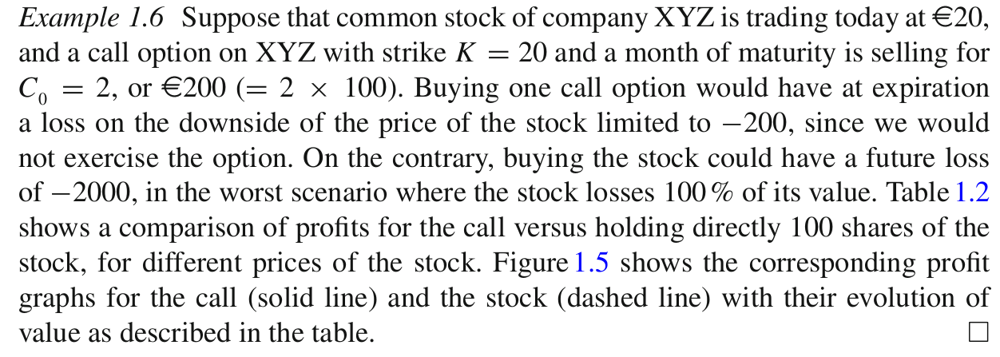

 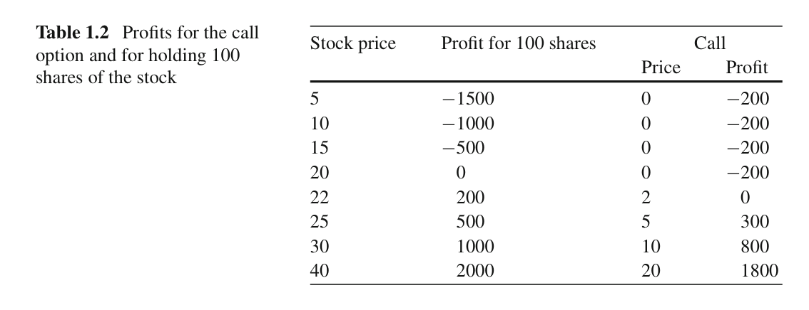
 
 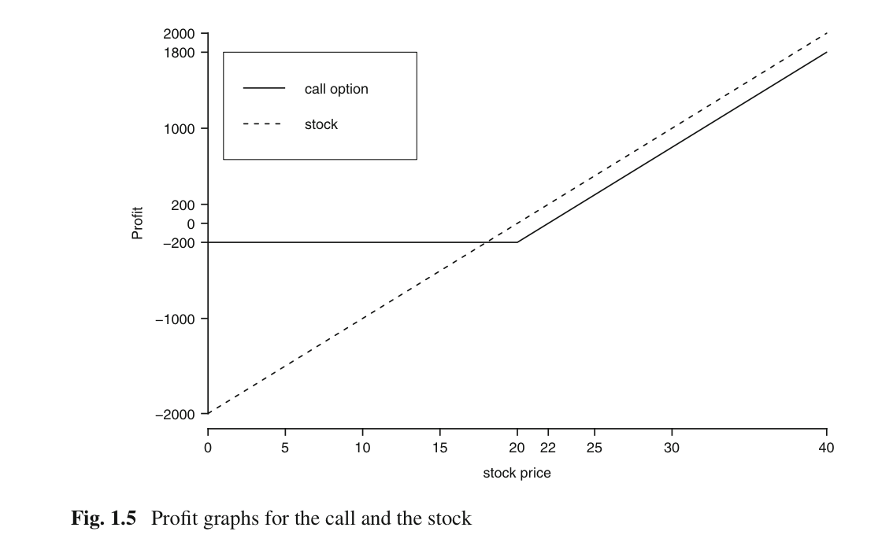
 
 
#### Example 1.7 
 
 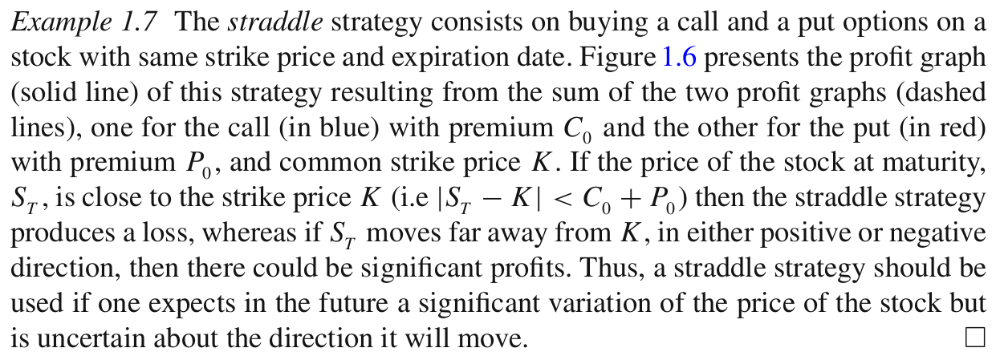
 
 
 


### The option pricing problem

 * witer
 * holder
 * Thus, the problem of pricing an option is to determine a price for the option contract that is deemed fair for the writer and the holder; that is, an amount of cash that the buyer should be willing to pay and the seller should charge and not systematically lose.
 * The solution to this problem seems at first to depend on the possibly different attitudes to risk held by each party of the option contract, and therefore, we can not pretend to have a “universal” solution: one formula good for all buyers and sellers of options.


### Forward and futures contracts

 * http://blog.daum.net/_blog/BlogTypeView.do?blogid=0KhAe&articleno=5291921
 * Forward and futures contracts are derivatives that differ from options essentially in their terms of liability. 
 * In these contracts two parties subscribe an obligation to trade a specific asset (one party to buy it and the other to sell it), 
 * for a specified price (the delivery price) 
 * and at a specified future date (for the forward contract)  or time period (e.g. a month, for the futures contract). 
 * The asset specified in the contract is usually any commodity (i. e. agricultural products or raw materials), currencies, or bonds, but could also be any stock.
 * forward
 * futures

### Payoff and profit

---------------

## 1.1.4 Portfolios and Collective Investment
 
  * portfolio 
  * positions
  * opening, closing (closing out)
  * asset allocation
  * minimize risk and maximize profits -> optimization problem
  
  

### Mutual funds and ETF
 
  * mutual funds - http://ko.wikipedia.org/wiki/%EB%AE%A4%EC%B6%94%EC%96%BC_%ED%8E%80%EB%93%9C
   - closed-end
   - open-end
  * ETF - http://ko.wikipedia.org/wiki/%EC%83%81%EC%9E%A5%EC%A7%80%EC%88%98_%ED%8E%80%EB%93%9C
  
  
---------------

# 1.2 Financial Engineering

 * What attitudes should we have towards investment? 
 * What is a fair price to pay for a security? 
 * How to control risk and secure some benefits?
 * content  
  - 1.2.1 Trading Positions and Attitudes
  - 1.2.2 On Price and Value of Stocks. The Discounted Cash Flow model
  - 1.2.3 Arbitrage and Risk-Neutral Valuation Principle
  - 1.2.4 The Efficient Market Hypothesis and Computational Complexity

------------------

## 1.2.1 Trading Positions and Attitudes

### Long and short positions

 * In the financial parlance, when an investor owns a security it is said that she is long in that security, and when she owes the value of a security she is short in that security.
 
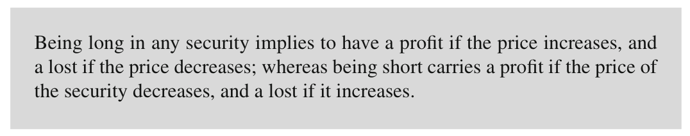

 * For example, 
  - the buyer of a call option is long on the option, while the writer of that option is short.
  - In a forward contract, one of the parties assumes a long position by agreeing to buy the underlying asset while the other party assumes a short position by agreeing to sell it. 
  - The buyer of a stock opens a long position on the stock. But selling a stock one owns does not means to become short on that stock, it just means to close the long position. 
  - To have a short position on a stock one has to borrow shares of the stock from some broker and sells them in the exchange market. = short selling (공매도) - http://ko.wikipedia.org/wiki/%EA%B3%B5%EB%A7%A4%EB%8F%84
  
#### Example 1.8 (A portfolio insurance strategy)

Suppose an investor is long on stocks from XYZ. Then to cover himself from possible losses, in the event that the price of the stock goes down, he can simultaneously enter into a long position on a put option (i.e. a long put) for similar amount of XYZ shares. In this way the investor is sure to sell part of the stock at the strike price of the put. For this strategy it is preferable to have the flexibility of an American put option. 
 
### Hedgers, speculators and arbitrageurs
 * three types of traders 
 * hedgers
 * speculators
 * arbitrageurs
  - For example, suppose that the exchange rates of EUR/USD in Frankfurt quotes at $1.25, while in New York it quotes at $1.3 at some instant of time11 ; hence, the euro is undervalued in Frankfurt and overvalued in New York. An arbitrageur would exploit this imbalance by exchanging dollars for euros in Frankfurt and immediately exchange the euros for dollars in New York. The profit for each
dollar in this double exchange is 0.8–0.769 = 0.031 or a 3 % on the amount invested.
 * no arbitrage assumption
  - This assumption of the impossibility of arbitrage opportunities (or no arbitrage) is the basis for many arguments for valuing derivatives.


  
### Bulls and bears
 
 * bullish
 * bearish
 


### Market timing or buy-and-hold

 * buy-and-hold strategy
 * market timing stratgey


  
-------------------

## 1.2.2 On Price and Value of Stocks. The Discounted Cash Flow model


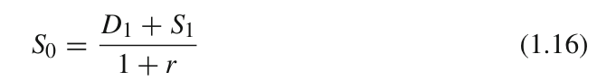


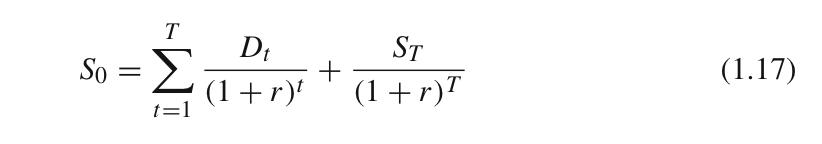


 <- market capitalization rate or cost of equity capital


#### Example 1.9


### A simpler closed formula (perpetual growth formula)

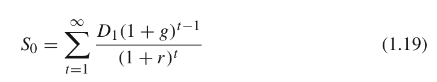


---------------------

##1.2.3 Arbitrage and Risk-Neutral Valuation Principle

Principle of No Arbitrage


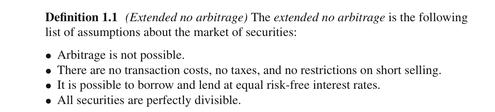


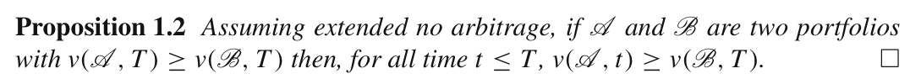

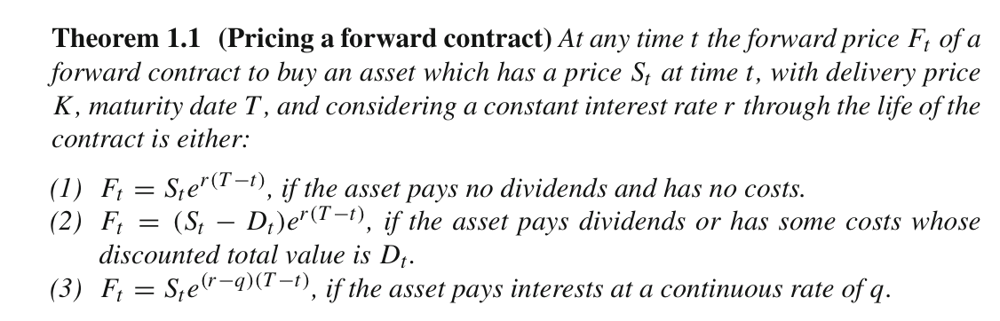


### Risk-neutral valuation

Another way to value an option can be derived from the assumption that investors are indifferent about risk. This is a strong hypothesis but make for doing pretty valuation. Observe that in a risk-neutral world all securities should behave much like a bond. Therefore, on the one hand, the rate of benefit that investors can expect from a stock should be equal to the risk-free rate, since they
don’t care about risk. And on the other hand, the present value of a derivative can be obtained by calculating its expected future value, and discounting it back to present at the risk-free rate (cf. Eq. (1.7)).


----------------------

## 1.2.4 The Efficient Market Hypothesis(EMH) and Computational Complexity

 * informative efficient
  - A more general paradigm for market equilibrium arises from the assumption that markets are “informationally efficient”. This means: The information available at the time of making an investment is already reflected in the prices of the securities, and in consequence market participants can not take advantage of this information to make a profit over the average market returns.
 
 * EMH 
  -  Weak : only the price history of the securities constitutes the available information.
  -  Semi–strong : all public information known up to the present time is available
  -  Strong : all public and private information (i.e., all possible information) known up to the present time is available.

 * computational complexity framework for market efficiecy
 

-----------------------

# 1.3 Notes, Computer Lab and Problems

------------------------

## 1.3.1 Bibliographic remarks

------------------------

## 1.3.2 Possibly the First Option Contract in History

------------------------

## 1.3.3 On Short Selling

------------------------

## 1.3.4 R Lab

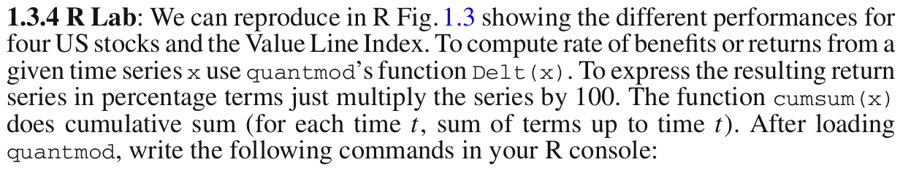


```r
symbols=c('VLIC','GE','KO','AAPL','MCD')
getSymbols(symbols,src='yahoo',from="2012-02-01",to="2013-02-01")
```

```
## [1] "VLIC" "GE"   "KO"   "AAPL" "MCD"
```

```r
#obtain adjusted closed
VLICad = VLIC$VLIC.Adjusted; GEad= GE$GE.Adjusted;
KOad=KO$KO.Adjusted; AAPLad=AAPL$AAPL.Adjusted; MCDad = MCD$MCD.Adjusted
#compute cumulative sum (cumsum) of daily returns (Delt)
#Remove first term of the series, with [-1,],
#since cumsum is not defined for it.
vl = cumsum((Delt(VLICad)*100)[-1,])
ge = cumsum((Delt(GEad)*100)[-1,])
ko = cumsum((Delt(KOad)*100)[-1,])
ap = cumsum((Delt(AAPLad)*100)[-1,])
md = cumsum((Delt(MCDad)*100)[-1,])
###range of values for the plot
lim = c(min(vl,ge,ko,ap,md),max(vl,ge,ko,ap,md))
###the plot
plot(vl,main="",ylim=lim,xlab="dates",ylab="% benefits")
lines(ge,col="green"); lines(ko,col="red")
lines(ap,col="violet"); lines(md,col="yellow")
legend(x="topleft",cex=0.4,c("VLIC","GE","KO","AAPL","MCD"), lty=1, col=c("black","green","red","violet","yellow"))
```

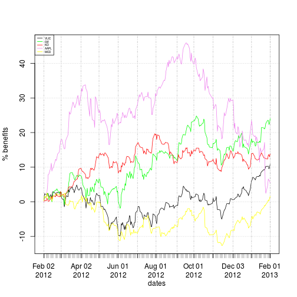 
------------------------

## 1.3.5 Research Problem

------------------------

## 1.3.6 Problem (Simple Bounds on Calls and Puts)


------------------------

## 1.3.7 Problem (More Strategies with Options)

 * The strangle
 * The strip
 * The strap
 * The butterfly spread

------------------------

## 1.3.8 Problem

------------------------

## 1.3.9 Problem


