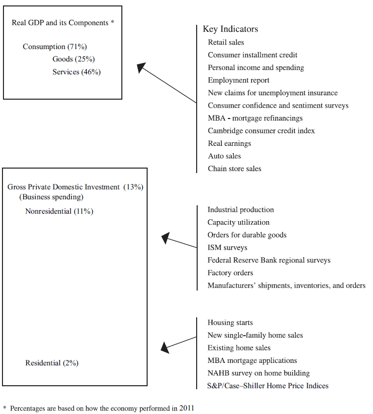
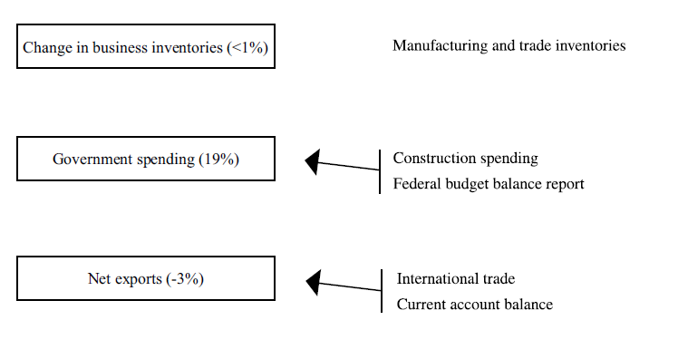
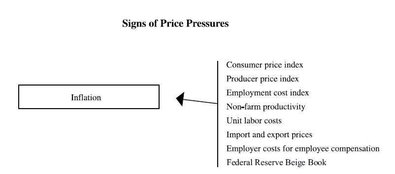
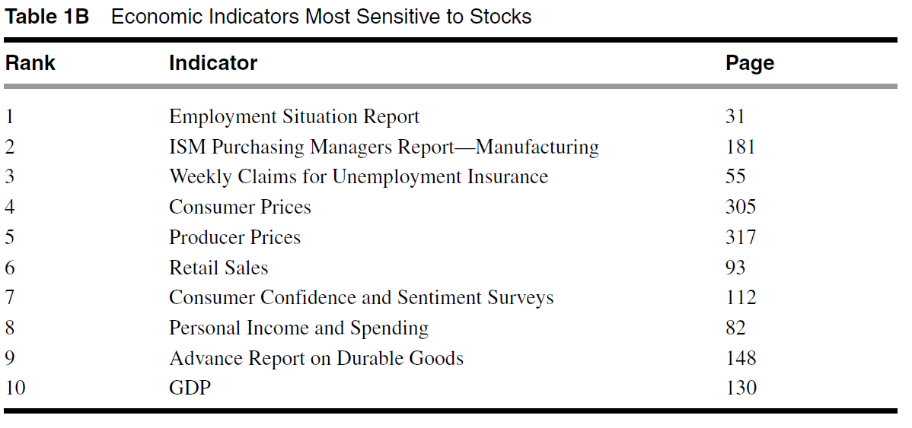
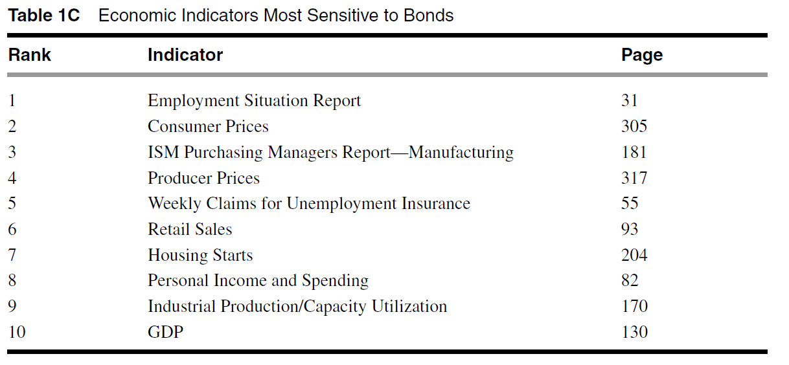
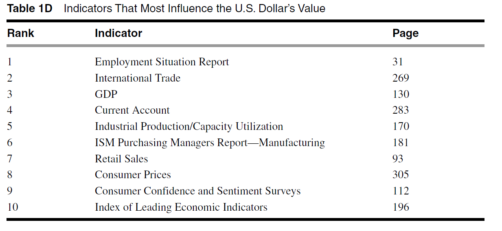
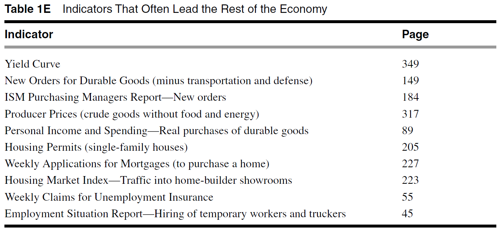
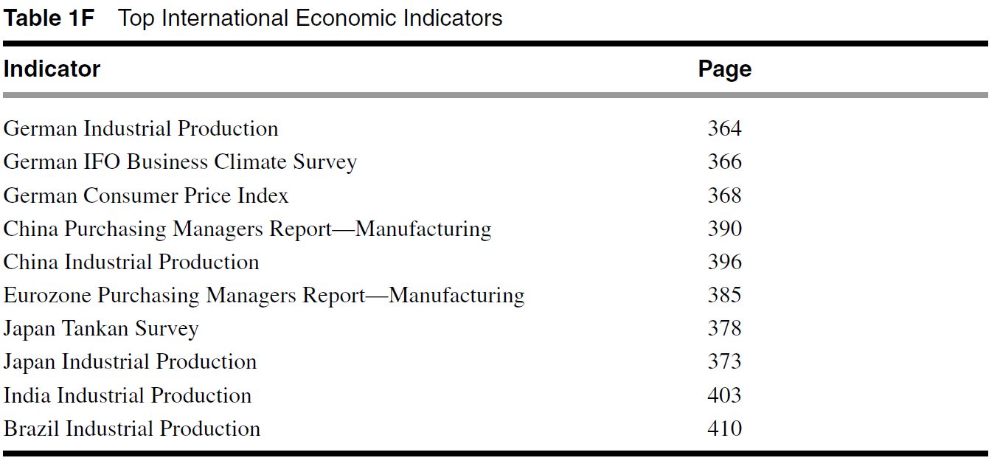
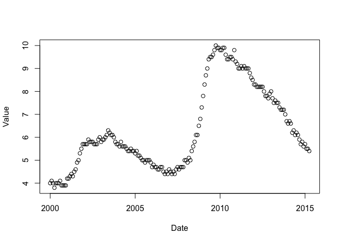
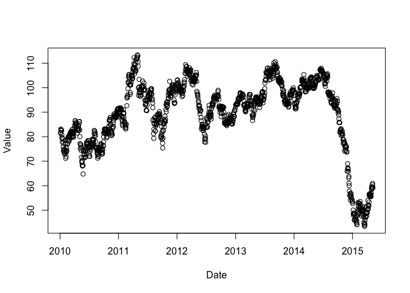

# InterEco_15050215
jspark  
Sunday, May 10, 2015  

# 국제경제학 실습과 활용

## 경제지표 활용

### 1. 세계경제지표의 비밀 
### Chapter 1. 감금

**1챕터 감금**    
제목이 '감금'이라 무슨 얘기일까 으아했는데요
경제지표의 발표를 미국에서 얼마나 중요하게 생각하는지를
보여주는 대목인것 같았습니다.    

이렇게 영향력 있는 경제지표를 공정하게 공급하기 위해 노력을 하곤 있지만,     
엠바고를 어기는 문제가 지속적으로 언급되고 있습니다.    

```
한편, 노동부도 지난 2011년에 보고서를 통해 경제지표의 유출 가능성을 언급한 바 있다. 

통상 노동부는 락업룸(lockup room)에서 발표 30분 전에 경제지표를 기자들에게 공개하는데 몇몇 언론사가 네트워크 장비를 이용해 지표를 유출할 수 있다는 것이다. 

락업룸에는 엠바고 위반을 감시하는 블랙박스가 설치돼 있는데 일부 언론사가 블랙박스와 비슷하게 생겼지만 실제로 블랙박스 기능을 마비시키는 장치를 두고 지표를 빼 갈 수 있다고 보고서는 설명했다."
```
<br>[경제지표 유출 기사](http://news.einfomax.co.kr/news/articleView.html?idxno=55730)    
<br>

***1.2 경제지표 발표후 시장의 영향***    

책에서는 노동부의 고용지표가 긍정적으로 발표된 다음
CBOT, 정규주식 시장인 NYSE의 개장전 선물 거래시장인 CME에서의 주가지수 선물의 변동, 그리고 NYMEX의 원유등 상품거래와 전세계적인 통화시장의 움직임에 대해서 설명을 해주었습니다.    
<br>
우리나라에는 KRX라는 거래소 한군데에서 주식과 선물 모든 상품이 처리되기 때문에 참고용으로 전세계의 국가별 거래소 현황을 조사하였습니다.
<br>
[전세계의 국가별 증권 거래소](http://en.wikipedia.org/wiki/List_of_stock_exchanges) <br>
[전세계의 국가별 선물 거래소](http://en.wikipedia.org/wiki/List_of_futures_exchanges)

미국의 경우 증권 거래소만 16개가 <br>
선물 거래소가 11개로 구성되어 있습니다.

책에 나온 순서대로 구성을 해보았습니다.
<br>
[CBOT](http://ko.wikipedia.org/wiki/%EC%8B%9C%EC%B9%B4%EA%B3%A0_%EC%83%81%ED%92%88_%EA%B1%B0%EB%9E%98%EC%86%8C)
시카고 상품 거래소(Chicago Board of Trade : CBOT)는 1848년에 미국의 시카고에 설립된 농부와 상인을 연결시켜주기 위한 기관이다. 설립 당시의 주요 업무는 거래되는 곡물의 수량과 품질을 표준화하는 것이었는데, 이후 선물의 거래가 가능하게 하는 형태의 계약이 개발되었고 투자자들은 농산물 그 자체보다 농산물 인도 계약의 권리를 사고 파는 것에 주목하게 되었다.
<br> <br>
[NYSE](http://ko.wikipedia.org/wiki/%EB%89%B4%EC%9A%95_%EC%A6%9D%EA%B6%8C%EA%B1%B0%EB%9E%98%EC%86%8C)
뉴욕 증권거래소(영어: New York Stock Exchange, NYSE)는 미국 뉴욕 시에 있는 증권거래소로 세계의 주요 기업들의 주식이 상장되어 있는 곳이다.<br>
"Big Board"라는 별명을 가진 뉴욕 증권거래소(NYSE)는 뉴욕 기반의 증권거래소이다. 이는 달러 총액 기준으로 세계에서 가장 큰 증권거래소이고 등록된 회사 개수로는 두 번째로 가장 큰 증권거래소이다. 이 거래소의 주가 총액은 1990년대 사이에 NASDAQ에 추월당했다. 뉴욕 증권거래소는 2006년 12월 31일 기준으로 세계적으로 25.0조 달러의 자본 총액을 가지고 있다.
<br><br>
[CME](http://en.wikipedia.org/wiki/Chicago_Mercantile_Exchange)
시카고 선물 거래소 농산물 선물을 거래하던 시장으로 현재는 이자율 주식, 통화 상품 선물들도 거래를 하고 있습니다.
<br><br>
[NYMEX](http://ko.wikipedia.org/wiki/%EB%89%B4%EC%9A%95%EC%83%81%EC%97%85%EA%B1%B0%EB%9E%98%EC%86%8C)
뉴욕 상업 거래소 또는 뉴욕 상품 거래소(New York Mercantile Exchange, NYMEX)는 미국 뉴욕에 있는 세계에서 가장 큰 선물 거래소이다. 큰 두개의 분과는 뉴욕 상업 거래소와 뉴욕 선물 거래소(COMEX)이다. 

<br><br>

[통화시장](http://en.wikipedia.org/wiki/Foreign_exchange_market)

***기업별 시장참여 비율***    

Rank |  Name	                   | Market share
-----|---------------------------|--------------
1	   | United States Citi	       | 16.04%
2    | Germany Deutsche Bank	   | 15.67%
3	   | United Kingdom Barclays   | 10.91%
4	   | Switzerland UBS AG	       | 10.88%
5	   | United Kingdom HSBC	     | 7.12%
6	   | United States JPMorgan	   | 5.55%
7	   | US BOA Merrill Lynch	     | 4.38%
8	   | UK Royal Bank of Scotland | 3.25%
9	   | France BNP Paribas	       | 3.10%
10	 | US Goldman Sachs	         | 2.53%


***1.3 경제지표***

***미국의 경제지표***

매주 다양한 경제지표가 발표가 됩니다. 어떠한 한개의 경제지표가 앞으로 일어날 변화를 모두 보여줄 수는 없습니다.
다만, 개별적인 경제지표의 이러한 수치들을 이어 미래를 바라볼 수 있는 길로 만들어 가는 과정입니다.
이것들을 하나로 잘 모아봤을때 경제상황을 예측해 볼수 있는 큰 그림이 만들어집니다.
<br><br>
우리가 국제경제학 시간에 배운 GDP를 풀어서 보면 아래와 같이 표현이 됩니다.



인플레이션은 금리등에 큰 영향이 있기에 시장에서 중요하게 바라봅니다.

<br><br><br>

***정확도***<br>
일부의 경제지표는 다른 경제지표보다 신빙성이 높은데, 이러한 차이는 데이터가 어떻게 집계되는지가 영향을 미칩니다.
CPI의 경우 노동통계청에서 미국의 26,000개 소매점 80,000개의 상품의 가격이 어떻게 변했는지 전화인터뷰로 확인을 합니다.
소비자신뢰지수의 경우 Conference Board라는 곳에서 5,000가구에 매월 전화를 해서 물어봅니다.
응답자들에 따라 지표의 질적 신빙성이 차이가 생겨, 예전부터 개정치 발표때 큰 변화가 있는것들은 금융시장에서 큰 영향력이 없습니다.
예를들어 건설 투자지표의 경우 지난다음 개정이 많지만, CPI는 개정이 거의없어 중요한 지표로 사용됩니다.<br>
***발표기간***<br>
가까운 지표가 중요합니다. 고용지표의 경우 지난달의 수치가 발표되지만, 소비자 할부구입액은 2달이 지난 다음에야 발표되기에
큰 영향력이 없습니다.<br>
***경제싸이클의 위치***<br>
분명 중요한 경제지표였음에도 불구하고 좋은 수치가 발표되었지만, 각광을 받지 못하는 경우가 있습니다.<br>
이것은 현재 경제싸이클이 어느위치에 있느냐에따라 달라집니다.<br>
경제침체가 지속되고 있다면, 많은 사람들이 실업의 상태이고 제조업도 가동률이 낮은 상태이기 때문에<br>
인플레이션은 관심이 없으며 CPI가 변동한다해서 활황기처럼 큰영향이 없게됩니다.<br>
***예측가능성***<br>
내구제의 선주문은 앞으롷 일어날 고용개선과 제조업 생산을 예상해볼수 있기에 주용한 지표로 사용된다.<br>
***관심도***<br>
투자자, 경제학자, 제조업자 등이 관심을 가지고 있는 지표는 따로 있다.<br>
비즈니스 관련 직종은 미국의 소비심리를 확인해보기 위해 재고주택판매와 고용지표들을 살펴볼 것이다.<br>
주택, 가구, 가전제품 직종은 신규재고와 공장폐쇄등을 살펴볼 것이다.<br>

***선행지표***<br>
선행지표라 할수 있는것은, 신규 실업보험청구건수, 건축허가, ISM제조업지수, 채권 수익률곡선등 이다.<br>


<br><br><br>
주식시장에 민감한 경제지표<br>
<br>
채권시장에 민감한 경제지표<br>
<br>
달러가치에 민감한 경제지표<br>
<br>
경제 전반을 선생하는 경제지표<br>
<br>
중요한 국제 경제지표<br>
<br>


### 2. API를 이용하여 데이터 불러오기


**2.1 R의 시장관련 API**   
R을 이용한 API는 여러가지가 있습니다.


[참고:http://www.r-bloggers.com/financial-data-accessible-from-r-part-iii/](http://www.r-bloggers.com/financial-data-accessible-from-r-part-iii/)

[참고:http://www.thertrader.com/](http://www.thertrader.com/)

quantmod랑 Quandl 두가지를 많이 사용하는것 같은데요
검색등이 편리한 Quandl을 이용해 보겠습니다.

[quantmod 참고자료: http://cran.r-project.org/web/packages/quantmod/quantmod.pdf](http://cran.r-project.org/web/packages/quantmod/quantmod.pdf)    

**2.2 Quandl 회원 가입**   
Quandl에 들어가서 진행을 해보겠습니다.   
[Quandl](https://www.quandl.com/)    
Github아이디랑 같이 묶을수 있어서 회원가입의 번거로움은 없습니다.

회원 가입을 하면 코드를 받게 되는데요
라이브러리를 불러올때 사용됩니다.


**2.3 API를 이용하여 불러오기**   


```r
library(Quandl)
```

```
## Warning: package 'Quandl' was built under R version 3.1.3
```

```
## Loading required package: xts
```

```
## Warning: package 'xts' was built under R version 3.1.2
```

```
## Loading required package: zoo
```

```
## Warning: package 'zoo' was built under R version 3.1.3
```

```
## 
## Attaching package: 'zoo'
## 
## The following objects are masked from 'package:base':
## 
##     as.Date, as.Date.numeric
```

```r
Quandl.auth("z4yj4Yn4ynskphR-Zz9A")
```


**2.4 FRED에서 실업률 불러오기**
지난주 금요일에 발표된 미국 4월 실업률이 5.4%를 기록하였습니다. 7년 만에 최저치 라고 하는데요, FRED에서 실업률을 불러와보겠습니다.
Quandl에서 unemployment rate로 검색해봅니다.

```r
UNRATE <- Quandl("FRED/UNRATE", start_date="2000-01-01", end_date="2015-05-10")
plot(UNRATE)
```

 


**2.5 유가 불러오기**

3월만 해도 배럴당 30달러까지 떨어진다던 유가가 다시 60달러까지 올라왔습니다. 여러가지 의견이 많지만 가격을 한번 찾아보겠습니다.    
Crude oil이라고 검색을 하면 여러가지가 뜹니다.
이중에 적합한 것을 찾아보겠습니다.    
[예.OPEC Crude Oil Price](https://www.quandl.com/data/OPEC/ORB-OPEC-Crude-Oil-Price)    
[예.WTI Crude Oil Spot Price Cushing, OK FOB](https://www.quandl.com/data/DOE/RWTC-WTI-Crude-Oil-Spot-Price-Cushing-OK-FOB)    
왼쪽에 있는 설명을 통하여 적합한 품목을 선택하시면 됩니다.    

OPEC의 경우 바스켓이구요. 쿠싱의 현물가를 이용해 보도록 하겠습니다.


```r
Crude_Price<-Quandl("DOE/RWTC", start_date="2010-01-01", end_date="2015-05-10")
plot(Crude_Price)
```

 

